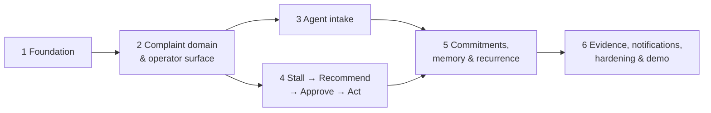

# Awwaz — Implementation Slices

This folder breaks `Awwaz_Full_PRD.md` into six vertically sliced, independently verifiable increments. Each slice ends with a running system that proves one more link of the PRD's core loop (§3):

> Understand → Structure → Route → Track → Detect → Recommend → Approve → Act → Verify → Remember

## Why slices rather than one pass

- The PRD spans two apps (Next.js + FastAPI), a database, a background worker, and an LLM agent. A single pass produces one enormous change where nothing is verifiable until everything is.
- The PRD's roadmap (§28) and prioritisation (§35) are already ordered by dependency. The slices follow that order.
- Every slice has a demo checkpoint drawn from §32. If work stops after any slice, what exists still demos coherently.
- Deterministic core first, AI second. Slices 1–2 have no LLM dependency, so the state machine, routing, timeline, and dashboard can be tested before a model key is needed.

## Slice map

| # | Slice | Proves | Size | Depends on |
|---|-------|--------|------|------------|
| 1 | [Foundation](01-foundation.md) ✅ | Both apps run against Postgres; demo auth, audit log, request IDs, and error envelope exist | L | — |
| 2 | [Complaint domain & operator surface](02-complaint-domain-and-operator-surface.md) | Structure → Route → Track: create and transition a case, see it on the dashboard and timeline | L | 1 |
| 3 | [Agent intake](03-agent-intake.md) | Understand: Roman Urdu message → clarification → real case via tool calls, with a visible trace | L | 2 |
| 4 | [Stall → Recommend → Approve → Act](04-stall-recommend-approve-act.md) | Detect → Recommend → Approve → Act → Verify: worker flags a seeded case, operator approves, mock adapter confirms | L | 2 |
| 5 | [Commitments, memory & recurrence](05-commitments-memory-recurrence.md) | Remember: missed commitment, related prior case, recurrence indicator | M | 3, 4 |
| 6 | [Evidence, notifications, hardening & demo](06-evidence-notifications-hardening-demo.md) | Production-shaped edges: uploads, notifications, rate limits, security tests, E2E demo path, runbook | M | 5 |

Slices 3 and 4 are independent of each other and could be built in either order (or in parallel). The recommended order is 3 then 4 because the demo script (§32) runs in that order.

## Working conventions

- **One slice at a time.** A slice starts only when the previous slice's Definition of Done is fully checked.
- **Each slice is a commit series on this branch**, prefixed `slice-N:` in commit subjects. The slice doc's status line is updated to `Done` in the final commit of the slice.
- **Definition of Done is binary.** Every checkbox in the slice's DoD must be true. Partially done items are called out explicitly, never silently dropped.
- **Tests ship with the slice**, not afterwards. Each slice lists the tests it must add. `make check` (lint, typecheck, tests, build) must pass at the end of every slice.
- **Migrations per slice.** Each slice adds its own Alembic revision. The seed script is cumulative and idempotent (`python -m app.seed` can always be re-run).
- **No false success.** Any path that touches the LLM or the civic adapter must fail truthfully (PRD principle 3). This is checked in every slice that adds such a path.
- **Server owns truth.** UI never derives state; it renders canonical server state and re-fetches after mutations (A14).

## Decision log

Defaults chosen where the PRD left something open. Each can be overridden before the relevant slice starts.

| ID | Decision | Rationale | Affects |
|----|----------|-----------|---------|
| D1 | **LLM:** Anthropic Claude via the official `anthropic` Python SDK. Default model `claude-opus-5` (configurable via `LLM_MODEL`), adaptive thinking, strict tool schemas, structured outputs for extraction. `ANTHROPIC_API_KEY` replaces the PRD's `LLM_API_KEY` so the SDK's default credential resolution works. `AWWAZ_LLM_MODE=live\|fixture` switches to a deterministic fixture client for tests and the demo backup plan (Appendix G). | Structured output + tool calling + multilingual are the PRD's required capabilities (§18). Fixture mode makes the whole loop testable offline. | 3, 5 |
| D2 | **Database:** PostgreSQL 16, SQLAlchemy 2.x (sync engine, psycopg 3), Alembic migrations. Tests run against a real throwaway Postgres database, not SQLite. | PRD mandates PostgreSQL. Sync SQLAlchemy keeps the domain layer simple and testable; FastAPI runs sync endpoints in a threadpool. | all |
| D3 | **Auth:** demo sessions. Three seeded personas (Hamza/CITIZEN, Sara/OPERATOR, Bilal/ADMIN) plus a SERVICE user for the worker. `POST /auth/demo-login` creates a server-side session row and sets an opaque HttpOnly cookie. No passwords. Everything hangs off one `current_actor` dependency so a hosted provider can replace it later (§15). | PRD §15 says use the simplest secure mechanism; no sponsor auth provider is verified. | 1 |
| D4 | **Frontend:** Next.js (App Router), TypeScript strict, Tailwind CSS, TanStack Query, zod. Next rewrites proxy `/api/*` to the backend so the session cookie stays same-origin; backend CORS is also configured for split deployments. | PRD §9 names Next.js + App Router + TanStack Query. Rewrites remove cookie/CORS friction during the hackathon. | 1+ |
| D5 | **Worker:** a separate process (`python -m app.workers.scheduler`) running the stall detector and commitment checker on a fixed interval (default 30 s), plus an ADMIN-only `POST /admin/demo/run-worker` trigger for live demos. No queue. | PRD §8: "Lightweight scheduled worker for MVP. Queue: not required." | 4, 5 |
| D6 | **Storage:** `StorageService` interface with a local-disk implementation by default; S3-compatible adapter is a drop-in later. | Evidence is P1; live object storage is not a demo dependency (§18). | 6 |
| D7 | **Identifiers:** UUID primary keys plus a human-readable `reference` (`A1024` style) on complaints, generated from a DB sequence. | Appendix F and the demo script refer to cases by `A10xx`. | 2 |
| D8 | **Package managers:** `uv` for the backend, `pnpm` for the frontend. Both are installed in the build environment. | Speed and lockfile determinism. | 1 |
| D9 | **Escalation status semantics:** approving an ESCALATE recommendation moves the case to `ESCALATION_PENDING` (records the human decision). Only adapter confirmation moves it to `ESCALATED`. On adapter failure the case stays `ESCALATION_PENDING`, the recommendation becomes `FAILED`, and retry is available. | Reconciles §14's `ESCALATION_PENDING` status with Flow I / A9 ("case is not marked ESCALATED"). The state change reflects the approval, not the unconfirmed external action. | 4 |
| D10 | **Configuration in the database.** Departments, routing rules, escalation chain, and stall thresholds are DB tables seeded from `database/seed/*.yaml`. Prompts read them at runtime; nothing category-related is hard-coded in a prompt. | Appendix A: "The mapping must be configurable and not hard-coded in the prompt." | 2, 3 |
| D11 | **Time:** all timestamps `timestamptz` in UTC. Seed data uses offsets relative to "now" (e.g. assigned 72 h ago) so demo data never goes stale. | §20 timezone rule; Appendix F describes seeds in relative terms. | 2+ |
| D12 | **Rate limiting** is an in-memory token bucket applied in slice 6, not slice 1. | Needed for §16 but not for a working loop; keeping slice 1 lean. | 6 |

## PRD acceptance matrix → slice

| Acceptance (Appendix J) | Delivered in |
|---|---|
| A1 Natural language intake | 3 |
| A2 No hallucinated case ID | 3 |
| A3 Clarification | 3 |
| A4 State transition | 2 |
| A5 Invalid transition | 2 |
| A6 Stall detection | 4 |
| A7 Commitment miss | 5 |
| A8 Approval exactly once | 4 |
| A9 Adapter failure | 4 |
| A10 Audit | 1 (mechanism), 2, 4 (coverage) |
| A11 Citizen privacy | 2 |
| A12 Prompt injection | 3 |
| A13 Recurrence | 5 |
| A14 Refresh consistency | 2, re-checked every slice |
| A15 Empty dashboard | 2 |

## PRD gaps noticed and how they are resolved

- **F1–F22 (§6) share identical boilerplate** apart from the objective line. The concrete logic per feature is specified in the slice docs instead.
- **State transitions are not enumerated.** Defined in slice 2.
- **Seed A1027 references A1011**, which is not in Appendix F. A1011 is seeded as a historical resolved case (slice 2).
- **"Progress event" for stall detection is undefined.** Defined in slice 2 (`PROGRESS_EVENT_TYPES`) and consumed in slice 4.
- **"Normalized location key" for recurrence is undefined.** Defined in slice 5.
- **`LLM_API_KEY` → `ANTHROPIC_API_KEY`** (D1).
- **Admin configuration (F22, P2)** is delivered read-only in slice 6. A write UI is out of MVP scope.
- **"Approval cannot be overridden by user text"**: enforced structurally. The LLM's tool registry never contains an execute/approve tool (slice 3), and the approval endpoint is operator-only (slice 4).

## How to proceed

Reply with `go` to start slice 1 as specified, or name a decision ID above to change it first. Each slice will be committed and pushed to this branch as it completes, with the slice doc's status line updated.
